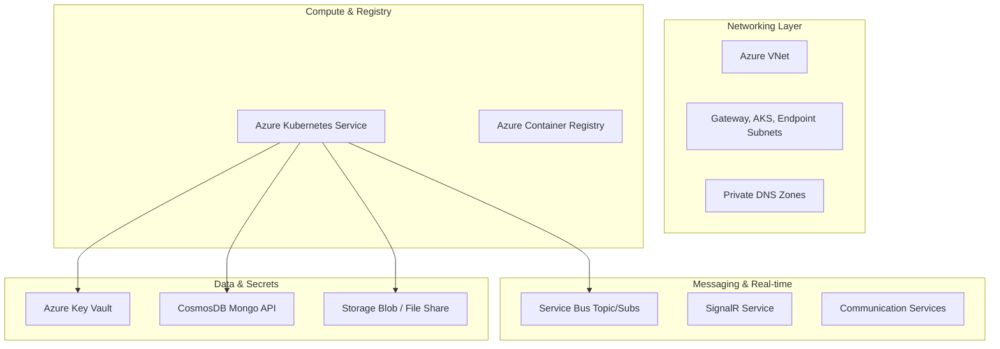

# 🏗️ OrganiStation Infrastructure as Code (Terraform)

This project manages the end-to-end Azure cloud infrastructure for the OrganiStation platform. It is engineered with a **Security-First** and **Modular** approach, ensuring repeatable deployments across multiple environments.

---

## 🏛️ Architecture Overview

The infrastructure is broken down into 16 specialized modules, orchestrating the following cloud components:



---

## 📦 Modular Structure

| Module | Responsibility | High-Res Feature |
| :--- | :--- | :--- |
| **`aks`** | Kubernetes Orchestration | Autoscaling Enabled + OIDC Issuer |
| **`networking`** | VNet & Subnet Slicing | Isolated subnetwork for Private Endpoints |
| **`storage`** | Data Persistence | Blob (PDFs) & File Share (ChromaDB) |
| **`keyvault`** | Secret Management | RBAC-based access (No Access Policies) |
| **`servicebus`**| Messaging | Subscriptions for HR/Leave events |
| **`identity`** | Workload Identity | Provisioning for 8 service identities |
| **`private_dns`**| Internal Networking | `privatelink` zones for all PaaS services |

---

## 🌓 Environment Workspaces

This project uses **Terraform Workspaces** to decouple environments:
- **`dev`**: Standard SKUs (Standard Service Bus, DS2_v2 Nodes) for cost-efficiency.
- **`prod`**: Premium SKUs (Premium Service Bus for Private Link, D4_v2 Nodes) for high availability.

---

## 🔐 Authentication & Security

### 1. Azure OIDC (OpenID Connect)
This project **does not use static client secrets**. It relies on GitHub Actions OIDC to authenticate with Azure.
- Ensure your GitHub Enterprise/Org is added as a **Federated Credential** on the Deployment Identity in Azure.

### 2. Private Link Enforcement
All high-risk services (CosmosDB, Storage, Key Vault) are protected by **Private Endpoints**. Public network access is disabled by default, ensuring traffic never leaves the Azure Backbone.

---

## 🚀 Usage Instructions

### Initialize the Backend
Ensure you have an Azure Storage account to host the Terraform state.
```bash
terraform init \
  -backend-config="resource_group_name=YOUR_TF_STATE_RG" \
  -backend-config="storage_account_name=YOUR_TF_STATE_STORE" \
  -backend-config="container_name=tfstate" \
  -backend-config="key=organistation.tfstate"
```

### Deployment Workflow
1.  **Select Workspace**: `terraform workspace select dev`
2.  **Plan Changes**: `terraform plan -var-file="dev.tfvars"`
3.  **Apply Changes**: `terraform apply -var-file="dev.tfvars"`

---

## 📋 Variables Cheat Sheet

| Variable | Type | Description |
| :--- | :--- | :--- |
| `project_name` | string | Prefix for all resources (e.g., `organistation`) |
| `location` | string | Target Azure Region (e.g., `eastus`) |
| `node_count` | number | Minimum AKS node count |
| `vm_size` | string | Azure VM Size for the node pool |

---

## 🛠️ Maintenance

- **Adding a Microservice**: Add the new service name to the `locals` block in `modules/workload_federation/main.tf` to generate the new Federated Credential.
- **Scaling nodes**: Update the `max_count` in your specific `.tfvars` file and run `terraform apply`.
