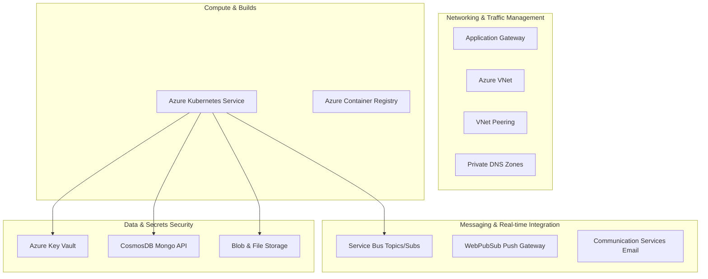

# 🏗️ OrganiStation Infrastructure as Code (Terraform)

This repository hosts the **Azure Infrastructure as Code (IaC)** configurations for the OrganiStation platform. It is engineered with a **Security-First**, **Modular**, and **Multi-Region** approach to guarantee automated, consistent deployments.

---

## 🏛️ Infrastructure Architecture

The platform's resources are partitioned into modular blocks, enabling rapid upgrades, isolated failure domains, and environment decoupling (Dev, Prod, DR):



---

## 📦 Infrastructure Modules (20 Specialized Blocks)

| Module | Responsibility | Key Attributes |
| :--- | :--- | :--- |
| **`resource_group`** | Core resource grouping | Creates the primary environment resource group. |
| **`dr_resource_group`**| Disaster recovery container | Creates the backup environment resource group in secondary region. |
| **`networking`** | Virtual network segmentation | Configures subnets for App Gateway, AKS Nodes, Private Endpoints, and Bastion. |
| **`dr_networking`** | DR virtual network | Sets up backup subnet ranges for failover capabilities. |
| **`vnet_peering`** | Inter-VNet routing | Establishes low-latency, private bi-directional peer links between VNets. |
| **`identity`** | Security identities | Provisions user-assigned managed identities for AKS control plane and kubelets. |
| **`acr`** | Container registry | Hosts secure, private Docker images with automated AKS pull bindings. |
| **`monitoring`** | Central log collection | Provisions a Log Analytics Workspace for unified telemetry. |
| **`application_insights`**| APM telemetry | Real-time monitoring, trace context, and log capturing for microservices. |
| **`private_dns`** | Name resolution | Manages internal resolution zones for Private Endpoint services (`privatelink`). |
| **`storage`** | File and blob shares | Provisions Blob storage for RAG PDFs and File share for ChromaDB vectors. |
| **`servicebus`** | Event broker | Configures messaging topics and subscriptions for leave/approval events. |
| **`communication_services`**| Transactional mail client | Provisions the mail service for outbound alerts. |
| **`keyvault`** | Secret and key vault | Stores environment secret parameters using Azure RBAC validation. |
| **`cosmosdb`** | Persistent database | Deploys Cosmos DB Mongo API with replica regions enabled for high availability. |
| **`aks`** | Kubernetes runner | Spins up the AKS cluster with autoscaling, system pools, and OIDC settings. |
| **`app_gateway`** | Layer-7 load balancing | Manages public SSL traffic termination and Ingress path routing. |
| **`bastion`** | Secure management access | Deploys a managed bastion host for secure console access to nodes. |
| **`workload_federation`**| Identity federation | Binds AKS ServiceAccounts directly to Azure AD/Entra identities. |

---

## 🌓 Decoupled Environments (Workspaces)

Environments are completely isolated using **Terraform Workspaces** and variable files:

- **`dev` workspace**: Uses cost-optimized SKUs (Standard Service Bus, DS2_v2 VM nodes, single-region DB).
- **`prod` workspace**: Enforces geo-replication (CosmosDB in failover regions, Premium Service Bus, larger node pools, Private Endpoint lockdown).

---

## 🔒 Security Best Practices Enforced

1. **Zero Secret Footprint**: Authentication utilizes **Azure Workload Identity** and OIDC. No long-lived Service Principal credentials or passwords are stored in the codebase or GitHub Actions.
2. **Private Network Backbone**: Public access is disabled on Cosmos DB, Storage Accounts, and Key Vault. Communication occurs entirely over **Private Endpoints** inside the VNet.
3. **Least Privilege access**: Key Vault access is managed strictly through Azure RBAC, eliminating legacy Access Policies.

---

## 🚀 Execution & Usage

### 1. Initialize State Backend
```bash
terraform init \
  -backend-config="resource_group_name=tfstate-rg" \
  -backend-config="storage_account_name=organistationtfstate" \
  -backend-config="container_name=statefiles" \
  -backend-config="key=organistation.tfstate"
```

### 2. Deploy Infrastructure
```bash
# Select environment
terraform workspace select dev

# Plan infrastructure changes
terraform plan -var-file="dev.tfvars"

# Apply changes
terraform apply -var-file="dev.tfvars" -auto-approve
```
